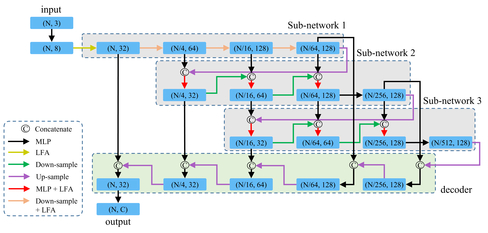

# Waterfall-Net: Waterfall Feature Aggregation for Point Cloud Semantic Segmentation

This is the official implementation of Waterfall-Net (PRCV 2022), a new point cloud semantic segmentation paradigm with waterfall feature aggregation. For technical details, please refer to:

**Waterfall-Net: Waterfall Feature Aggregation for Point Cloud Semantic Segmentation**<br />
Hui Shuai, Xiang Xu, Qingshan Liu.<br />
**[[paper](https://link.springer.com/chapter/10.1007/978-3-031-18913-5_3          )]**



### (1) Setup

This code has been tested with Python 3.6, Tensorflow 1.13.1, CUDA 10.0 on Ubuntu 16.04.

- Clone the repository

```shell
git clone https://github.com/Xiangxu-0103/Waterfall-Net.git && cd Waterfall-Net
```

- Setup python environment

```shell
conda create -n waterfallnet python=3.6.8
conda activate waterfallnet
pip install tensorflow-gpu==1.13.1
pip install -r helper_requirements.txt
sh compile_op.sh
```

### (2) S3DIS

S3DIS dataset can be found <a href="https://docs.google.com/forms/d/e/1FAIpQLScDimvNMCGhy_rmBA2gHfDu3naktRm6A8BPwAWWDv-Uhm6Shw/viewform?c=0&w=1">here</a>. Download the files named "Stanford3dDataset_v1.2_Aligned_Version.zip". Uncompress the folder and move it to `/home/data/S3DIS`.

- Preparing the dataset:

```shell
python utils/data_prepare_s3dis.py
```

- Start 6-fold cross validation:

```shell
sh jobs_6_fold_cv_s3dis.sh
```

- Move all the generated results (*.ply) in `/test` folder to `/home/data/S3DIS/results`, calculate the final mean IoU results:

```shell
python utils/6_fold_cv.py
```

### Citation

If you find our work useful in your research, please consider citing:

```
@inproceedings{shuai2022waterfall,
  title={Waterfall-Net: Waterfall Feature Aggregation for Point Cloud Semantic Segmentation},
  author={Shuai, Hui and Xu, Xiang and Liu, Qingshan},
  booktitle={Pattern Recognition and Computer Vision: 5th Chinese Conference, PRCV 2022, Shenzhen, China, November 4--7, 2022, Proceedings, Part III},
  pages={28--40},
  year={2022},
  organization={Springer}
}
```

### Acknowledge

- Our code refers to <a href="https://github.com/QingyongHu/RandLA-Net">RandLA-Net</a>.
